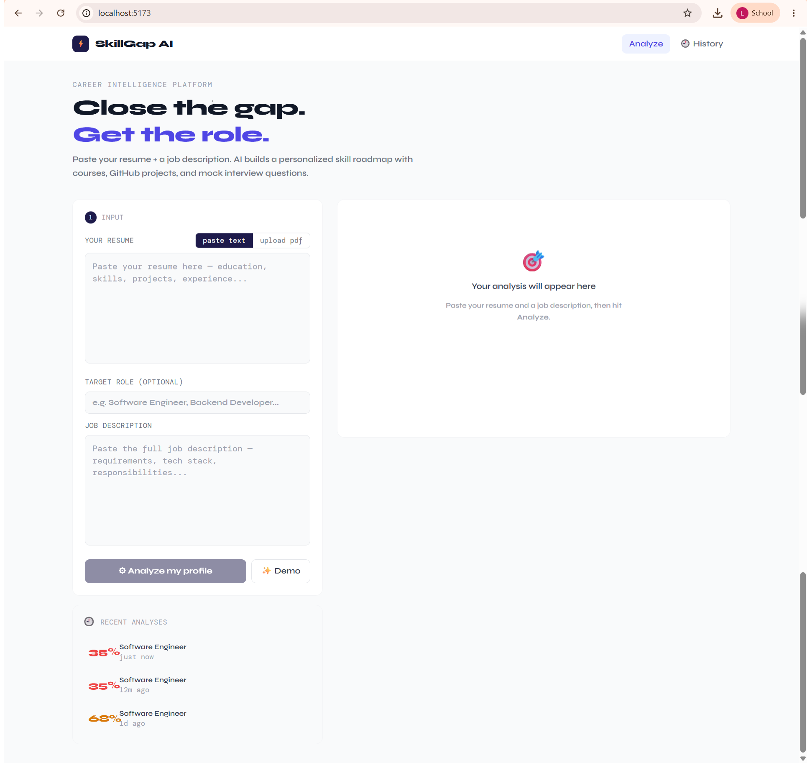

# SkillGap AI

An AI-powered career intelligence tool: paste your resume and a job description, and
get back a match score, a prioritized skill-gap breakdown, a personalized learning
roadmap, and tailored mock interview questions.
## 🔗 Live Demo

**App:** [https://skillgap-ai-pro.onrender.com](https://skillgap-ai-pro.onrender.com)
**API:** [https://skillgap-ai-l2rz.onrender.com](https://skillgap-ai-l2rz.onrender.com)

> Hosted on Render's free tier. The backend spins down after ~15 minutes of
> inactivity, so the first request after idling may take 30–60 seconds to wake up —
> subsequent requests are fast. Analysis history resets on backend redeploys since the
> free tier doesn't include persistent disk storage.
<p align="center">
  
</p>

## Stack

| Layer       | Technology                                              |
|-------------|-----------------------------------------------------------|
| Frontend    | SvelteKit + TypeScript + Tailwind CSS + ApexCharts        |
| Backend     | Go + Fiber                                                 |
| Database    | BadgerDB (embedded, pure Go — no external DB server)      |
| AI          | Mistral AI (`mistral-large-latest`)                        |
| PDF parsing | `ledongthuc/pdf` (pure Go)                                 |
| Hosting     | Render (backend Web Service + frontend Static Site)       |

## Features

- Paste resume text or upload a PDF
- AI-generated match score, skill gaps (with priority + reasoning), a step-by-step
  roadmap (courses/projects/books/articles), and 6 tailored mock interview questions
- Full analysis history, persisted locally via BadgerDB — revisit or delete past runs
- No external database to install or configure — the whole backend is a single binary
  plus a local data folder

## Getting started

### Prerequisites

- [Go](https://go.dev/dl/) 1.22+
- [Node.js](https://nodejs.org/) 18+
- A [Mistral AI](https://console.mistral.ai/) API key

### 1. Backend

```bash
cd backend
cp .env.example .env
# edit .env and set MISTRAL_API_KEY to your real key

go mod tidy
go run main.go
# → http://localhost:8080
```

The server validates `MISTRAL_API_KEY` on startup and refuses to boot with a clear
error message if it's missing or still the placeholder value — so a bad key shows up
immediately instead of as a mysterious 401 later.

### 2. Frontend

```bash
cd frontend
cp .env.example .env
npm install
npm run dev
# → http://localhost:5173
```

Open `http://localhost:5173`, click **Demo** to autofill a sample resume + job
description, then **Analyze my profile**.

## Deployment

Both services are deployed on [Render](https://render.com):

**Backend** — Web Service, deployed from `backend/Dockerfile`
MISTRAL_API_KEY=<your key>
BADGER_DB_PATH=./data/badger
ALLOWED_ORIGINS=https://skillgap-ai-pro.onrender.com
PORT=8080

**Frontend** — Static Site, built with `@sveltejs/adapter-static`
Build command: npm install && npm run build
Publish dir: build
VITE_API_URL= https://skillgap-ai-l2rz.onrender.com

> Note: Render's free tier doesn't provide persistent disks, so `BADGER_DB_PATH`
> points at the container's local (ephemeral) filesystem. Analysis history survives
> restarts within the same running container but resets on redeploys. For durable
> history in production, attach a paid persistent disk and mount it at that path.
## API reference

| Method | Route              | Description                                          |
|--------|--------------------|-------------------------------------------------------|
| POST   | `/api/analyze`     | multipart form: `resume_text` *or* `resume_file` (PDF), `job_description`, `target_role` |
| GET    | `/api/history`     | `?limit=10` — most recent analyses, newest first      |
| GET    | `/api/history/:id` | full analysis by ID                                    |
| DELETE | `/api/history/:id` | delete an analysis                                     |
| GET    | `/health`          | liveness check                                          |

## Project layout
backend/
main.go # Fiber app, CORS, graceful shutdown, BadgerDB lifecycle
handlers/ # HTTP handlers (analyze, history)
services/
ai.go # Mistral API call + response validation
pdf.go # PDF → text extraction
store.go # BadgerDB read/write/delete
models/models.go # Shared structs
prompts/prompts.go # System + analysis prompt builder
Dockerfile # Multi-stage build for deployment

frontend/
src/routes/+page.svelte # Home: input + results
src/routes/+page.ts # ssr = false (charts/file APIs are browser-only)
src/routes/history/+page.svelte # History list
src/lib/api.ts # Axios client
src/lib/types.ts # TS types mirroring the Go models
src/lib/components/*.svelte # ScoreCard, SkillGapList, Roadmap, MockInterview,
# ResumeInput, JDInput, HistorySidebar, Navbar
## Roadmap / further improvements

Rough priority order if you want to keep building this out:

**Reliability**
- [ ] Retry Mistral calls with exponential backoff on transient 429/5xx errors
- [ ] Add a request timeout + cancellation from the frontend (abort in-flight analyze calls)
- [ ] Structured logging (e.g. `zerolog`) instead of Fiber's default text logger
- [ ] Basic integration tests for the Go handlers (`httptest`) and a couple of Playwright e2e tests for the happy path

**Product**
- [ ] Export analysis as PDF (roadmap + gaps + questions) using a Go PDF-writing lib
- [ ] Compare multiple job descriptions against one resume side-by-side
- [ ] Track roadmap item completion (checkboxes persisted per analysis)
- [ ] Streaming AI responses (SSE) so the UI fills in progressively instead of one long spinner

**Security / production-readiness**
- [ ] Rate limiting per IP on `/api/analyze` (Mistral calls cost money — protect against abuse)
- [ ] Optional auth (JWT) if this ever needs to be multi-user instead of single-user/local
- [ ] Input sanitization on resume/JD text before sending to the LLM (prompt-injection hardening)
- [ ] Dockerfile + docker-compose for one-command spin-up

**Frontend polish**
- [ ] Dark mode
- [ ] Skeleton loaders instead of the spinner-only loading state
- [ ] Toast notifications for delete/error states instead of inline-only banners
- [ ] Mobile layout pass (current grid is optimized for desktop)

## License

MIT — do whatever you want with it.
